# Project GobangCat
#### powered by TwilightLemon
这是一只不怎么会下五子棋的人工智能猫咪，棋法古怪，棋力看心情
## 需求
游戏体验：
- [x] 1.基本游戏功能（下子、悔棋、重开）
- [x] 2.可自由选择玩家、先手
- [x] 3.AI能打过我
- [x] 4.可选难度  
- [x] 5.趣味性

开发体验：
- [x] 1.代码风格规范统一，易读
- [x] 2.代码结构清晰，模块化
- [x] 3.易于维护、拓展、调试、复用

## 设计与实现
### 遵从几个基本设计原则：  
- 源码组织 - 模块化、低耦合、高内聚
- - 按照功能分模块，依类别建立文件夹
- 代码风格 - 一致性、可读性、可维护性  
- - 命名规范 - 驼峰命名法(略偏向C#/Java)
- - 链式调用，例如：
```c++
    Players[1] = (new ChessTreeRobot())
    ->SetPlayer(PieceStatus::Black)
    ->SetEnableTreeSearch(true)
    ->SetEvaluator(EvaluatorType::ModelChecking)
    ->SetDynamicSetter([](int& depth,int &root, int &child) {...});
```
- MVVM设计模式
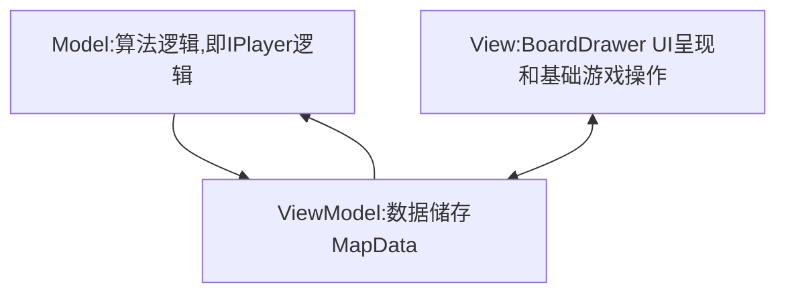
- 面对对象原则 - 封装、继承、抽象、多态
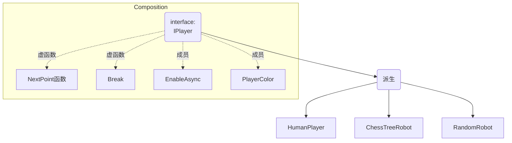

### 1.整体结构
#### 主要全局变量 (Model Data)
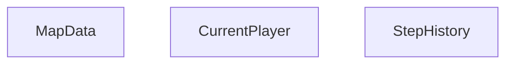
#### 游戏基本逻辑构架
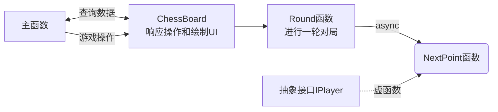
### 2.ChessTree:博弈树搜索算法
#### 组成
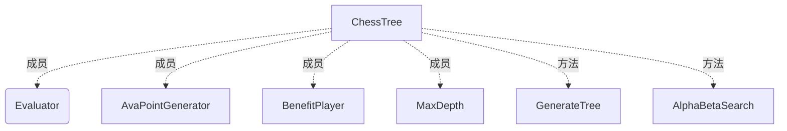
#### 如何走？ (深度优先)
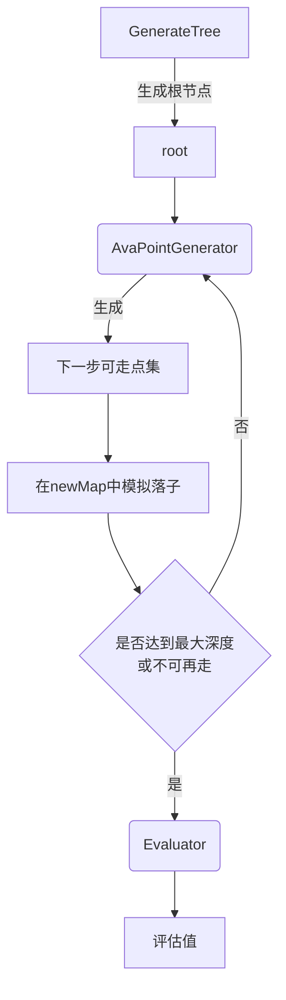
#### 博弈树结构——动态而不确定
整棵树结构如下：
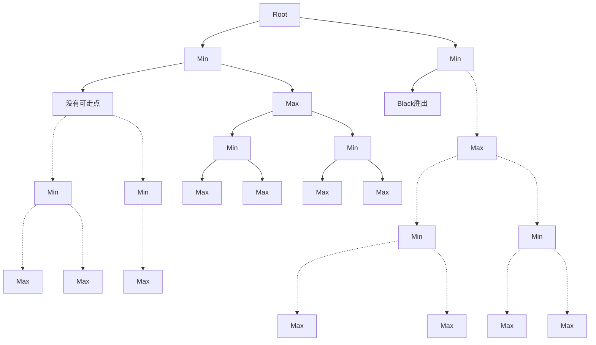
节点结构如下：
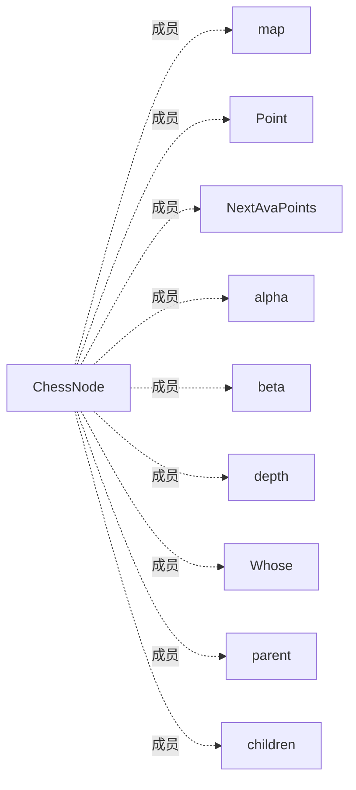

##### 动态生成和遍历树——根->枝->叶
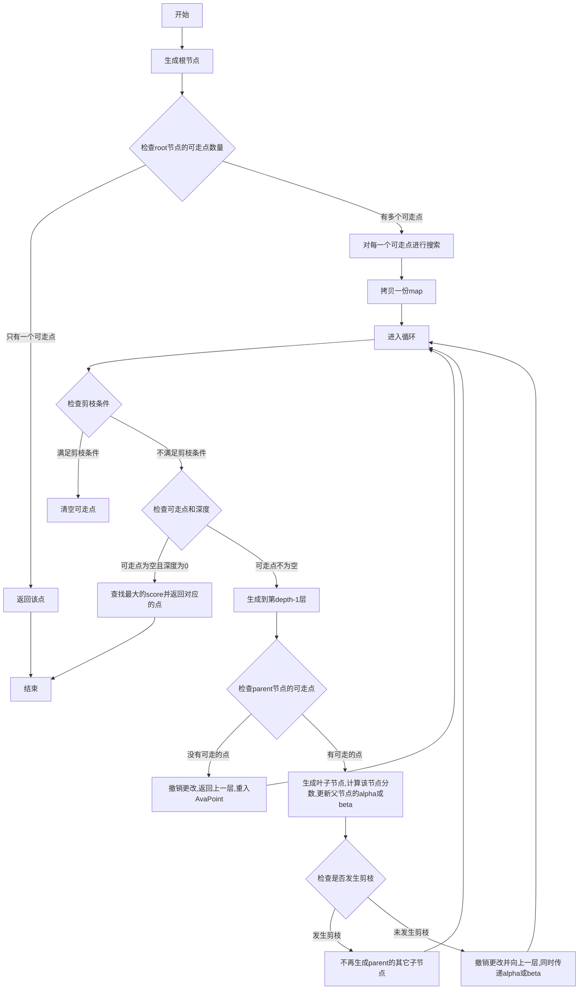

##### α-β搜索规则：
- 1.root由对手下子得到，则下一层为我方，选择最有利我方的节点，故root为Max节点  
- 2.上一层为我方下，则本层由对手下，选择对我方最不利节点，故为Min节点，依此类推
- 3.每生成下一个子节点，传递alpha和beta值，用于剪枝
- 4.直到达到最大深度或无子可下，由Evaluator评估后更新alpha或beta值
- 5.回溯更新：对于Max节点，alpha=max{本节点alpha,child.alpha,child.beta}；对于Min节点，beta=min{本节点beta,child.alpha,child.beta}
- 6.剪枝条件：alpha>=beta，不再生成子节点
- 7.搜索完成之后，检索root的子节点，选择alpha值最大且未被剪枝的节点

###### 具体在算法中有两处响应剪枝:
- 生成叶节点时触发
- 回溯更新时触发
### 3.ModelChecker:走子预判和评估
#### 组成
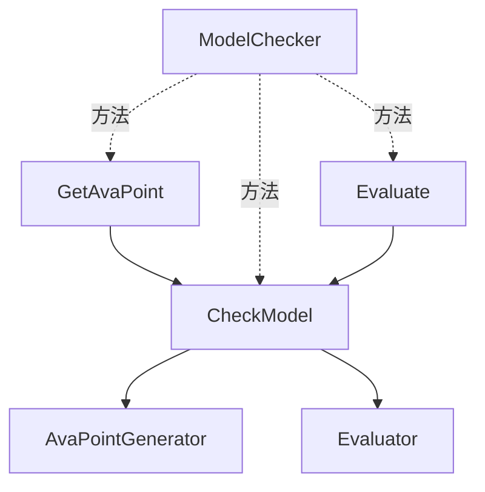
两个方法都会通过CheckModel来检查匹配到的模型，
每个模型结构如下：
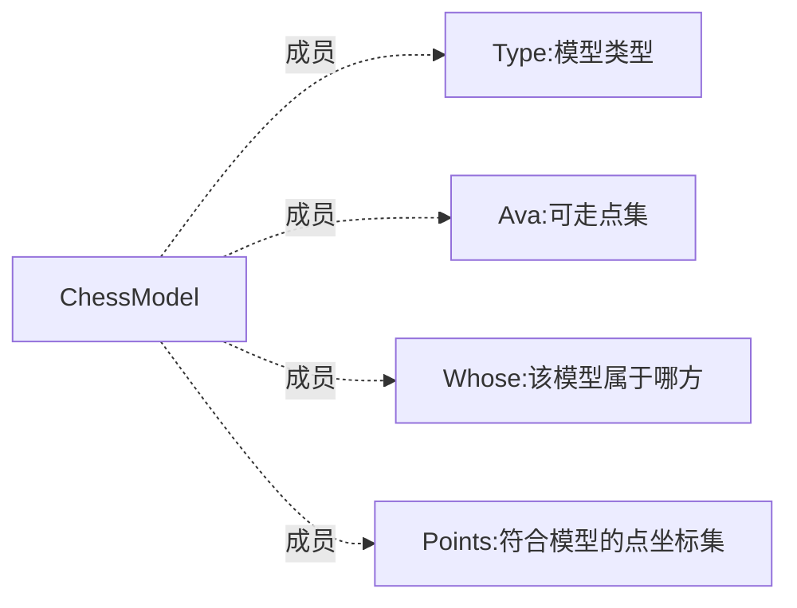
这些模型指示双方可走的点位以及危险等级。
#### CheckModel方法:传统的眠活冲模型以及二维模型检测
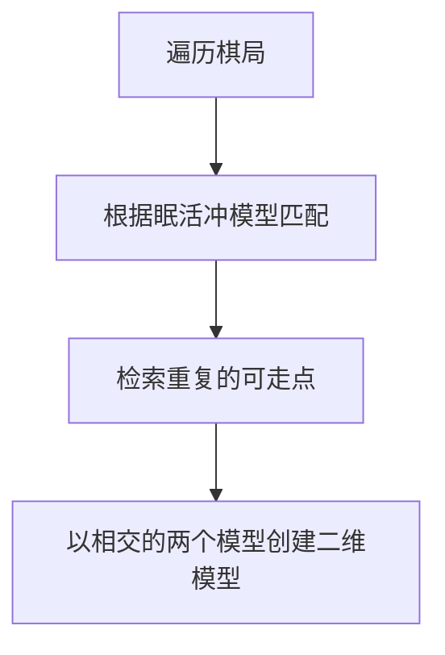
一些细节:
```c++
for (const auto &item: Checked) {
         //平行的重复点不是Cube模型
         int vec_x = item.Ava.x - item.Point.x, vec_y = item.Ava.y - item.Point.y;
         int inc_x = p.x - model.Points[0].x, inc_y = p.y - model.Points[0].y;
         //要求两模型为同一玩家
         if (item.Whose == model.Whose && item.Ava.Equal(p) && (vec_x * inc_y != vec_y * inc_x)) {
                 found = true;
                 foundModel = item;
                 break;
         }
}
```
#### GetAvaPoint方法:根据模型生成可走点
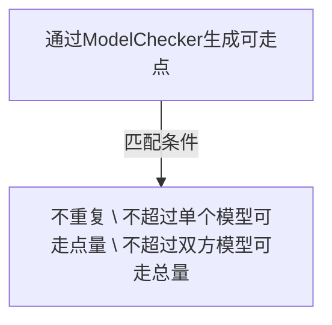
#### Evaluate方法:根据模型评估局势
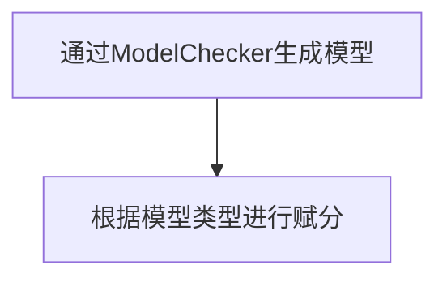

## 优化
### 1.棋盘数据和树的构建
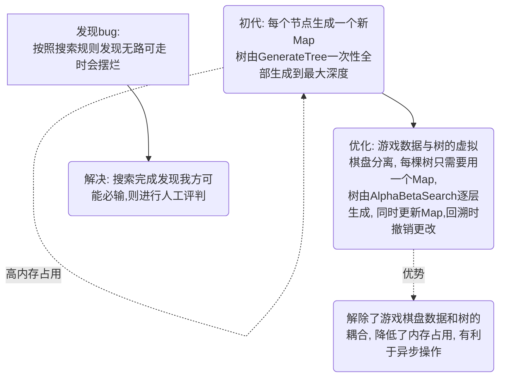
### 2.评估函数和可走点生成器
内置不同的评估函数(和可走点生成器)，以达到不同难度的AI
这里着重介绍ModelChecker, CountingEvaluator就是个简单的计数计分，不再赘述

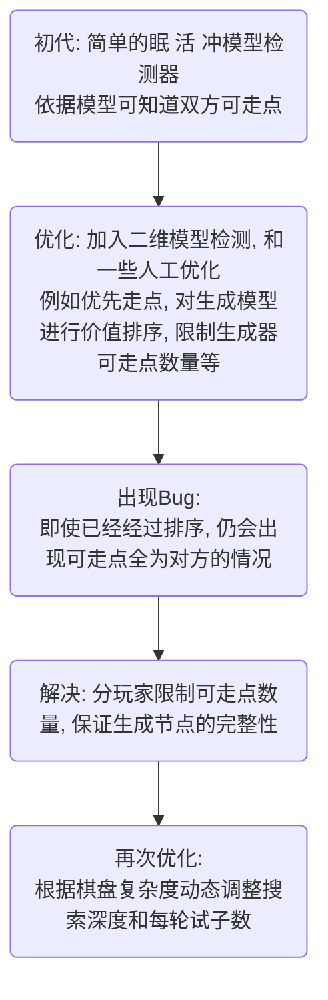
### 3.易用性改善
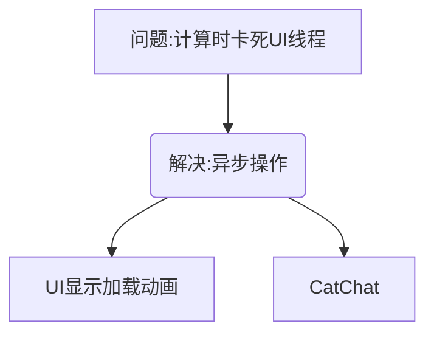
### 4.可维护性改善
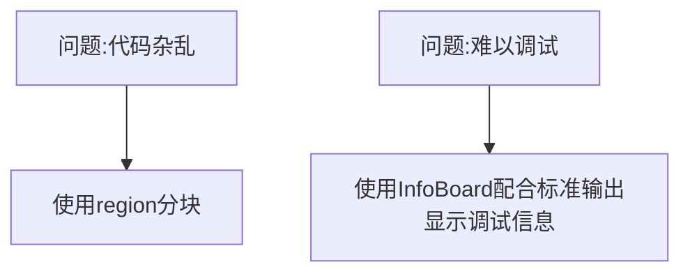


